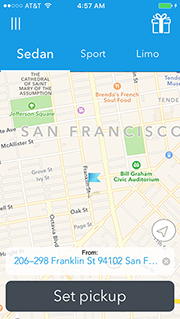
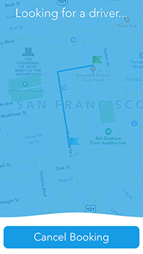
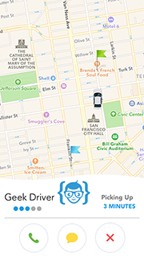

[](https://itunes.apple.com/us/app/geeknavi/id1086673235?mt=8)

# GeekNavi - Uber App Clone - SDK
Our Uber App Clone makes it possible for anybody, including those with little to no technical experience, to be able to fully and successfully operate their own navigation app by either customizing our template or by adding our SDK to their existing app.

## Quick Start
You could request a demo API key by contacting us at `support@GeekNavi.com`. If you're interested in purchasing a API key for production purposes, please choose your package [here](https://geeknavi.com/pricing).

```objective-c
#import "GeekNavi.h"

[GeekNavi setGeekNaviAPIKey:@""]; // Your GeekNavi API Key

// Optional
[GeekNavi setInviteText:@"I.. Love.. GeekNavi!"];
[GeekNavi setThemeColor:[UIColor colorWithRed:22.0/255.0f green:156.0/255.0f blue:229.0/255.0 alpha:1.0f]]; // Theme color
[GeekNavi setGoogleAPIKey:@"API_KEY"];
[GeekNavi setBackendPath:@"http://mybackend.com/ws/"];
[GeekNavi setStripePK_Key:@"pk_test_yourKey"];
```

## Demo

1. Either clone or download this repo and go to the GeekNavi directory.
2. Open the `.xcodeproj` file.
3. Input your GeekNavi API Key in the `AppDelegate.m` file. (If you don't have a key, request a demo key from us at: `support@GeekNavi.com`)
4. Run the app in the Simulator or on your device.


## Documentation

For a closer look at what you do with GeekNavi, check out our [iOS Documentation](doc/README.md) or simply download and read through our well-documented demo project.

### License

GeekNavi is available under the Apache 2.0 license. See the LICENSE file for more info.
